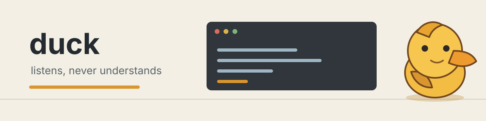

[](LICENSE)
[](https://github.com/Saber5656/duck/releases)
[](https://github.com/Saber5656/duck/actions/workflows/macos.yml)



# duck

> A rubber-duck debugging companion that listens and responds with gentle backchannels.
> It hears volume, but it never understands speech.


## Install

```sh
brew install --cask Saber5656/homebrew-tap/duck
```

The command becomes available after the first signed release and Homebrew tap setup. You can also download the notarized app from [GitHub Releases](https://github.com/Saber5656/duck/releases). duck supports macOS 13+ on Apple Silicon and Intel.

## Privacy

duck opens the microphone, so its boundary is deliberately small and inspectable:

| duck sees | duck never does |
| --- | --- |
| A transient microphone buffer while calculating one RMS loudness value | Speech-to-text, recording, or storing audio |
| `speechStarted` and `speechEnded` transitions derived from loudness and time | Speaker identification, keyword detection, or audio playback |
| No microphone-derived value after it is delivered to the in-memory VAD path | Writing audio-derived data to files, logs, or UserDefaults |

The only microphone buffer access is the [RMS reduction callback](https://github.com/Saber5656/duck/blob/59b726ca53ad4af8f94d55e4831aadf5a811abdf/Sources/DuckCore/AudioLevelSource.swift#L246-L251). The app bundle has no network entitlement or networking dependency; release automation is separate from the shipped app. The [privacy-guard workflow](.github/workflows/macos.yml) rejects forbidden speech, recording, or networking symbols in source, build, entitlement, and workflow files.

The macOS orange microphone dot is expected while Listening is on. Turn Listening off in the menu bar and duck releases its audio tap and engine. Control Center should then stop listing duck; if no other app is using the microphone, the orange dot goes out too. Zoom, Meet, and other apps may keep the system indicator on independently.

## What It Does

- Sits in a selected corner of the desktop while you explain a problem out loud.
- Nods while you speak, tilts its head after a pause, and gives a larger nod after a long explanation.
- Uses loudness and elapsed time only. It never understands, transcribes, or answers.

## Controls

| Control | Behavior |
| --- | --- |
| Listening | Starts or stops microphone access. Off fully releases the audio engine. |
| Nod once | Plays the reaction animation without microphone access. |
| Position | Places duck in one of the four corners of the primary screen's visible frame. |
| Sensitivity | Selects Low, Medium, or High relative loudness threshold. |
| Launch at Login | Registers or unregisters duck with macOS Login Items. |
| Open Microphone Settings | Opens the macOS privacy pane when permission is unavailable. |
| Quit | Stops audio and exits the app. |

## Verify A Download

Signed releases use the same bundle identifier so macOS can identify an update as the same app. Verify the downloaded bundle before launching it:

```sh
codesign --verify --deep --strict --verbose=2 /Applications/duck.app
codesign -d --entitlements :- /Applications/duck.app
```

The entitlement output should include App Sandbox and audio input, and should not include a network entitlement. The release workflow also verifies the Universal 2 binary, Developer ID signature, notarization, and stapled ticket before publishing its zip and checksum.

## FAQ

### Why did duck nod at my music?

The microphone can physically capture music, a fan, or a meeting speaker. duck sees loudness only and cannot know which sound produced it. Lower Sensitivity or turn Listening off during a meeting if the animation is distracting.

### Why is duck not visible in a full-screen app?

The overlay uses the macOS status-bar window level and intentionally does not cover full-screen apps. It remains on the selected corner of the primary display.

### How do I reset microphone permission?

Quit duck, run `tccutil reset Microphone dev.saber5656.duck`, then launch it again. The first-run permission flow will appear when you choose Start listening.

### Can duck send anything to the internet?

The shipped app has no network entitlement or networking dependency, and the microphone path reduces each buffer to one loudness value before delivering it to the in-memory VAD path. The release workflow uses GitHub Actions APIs only for publishing artifacts and the Homebrew cask.

### Will an update forget my microphone permission?

The release path uses Developer ID signing and keeps the bundle identifier `dev.saber5656.duck` stable. Test the installed release and its upgrade on the target macOS version; ad-hoc local builds do not provide the same update identity.

## License

The application is released under the [MIT License](LICENSE). The original sprites are released under [CC0 1.0](Resources/Sprites/LICENSE-assets).

## Development

The app is a native Swift and AppKit menu-bar application with no third-party runtime dependencies. Audio input is reduced to one RMS value in `Sources/DuckCore/AudioLevelSource.swift`; the overlay consumes VAD events only.

Run the local checks on macOS:

```sh
scripts/privacy-guard.sh
swift test
scripts/build-macos-app.sh
```

The app bundle is written to `.build/macos/duck.app`. Release builds are started by pushing a `v*` tag after the repository's Developer ID, Apple notarization, and Homebrew tap secrets have been configured manually.
